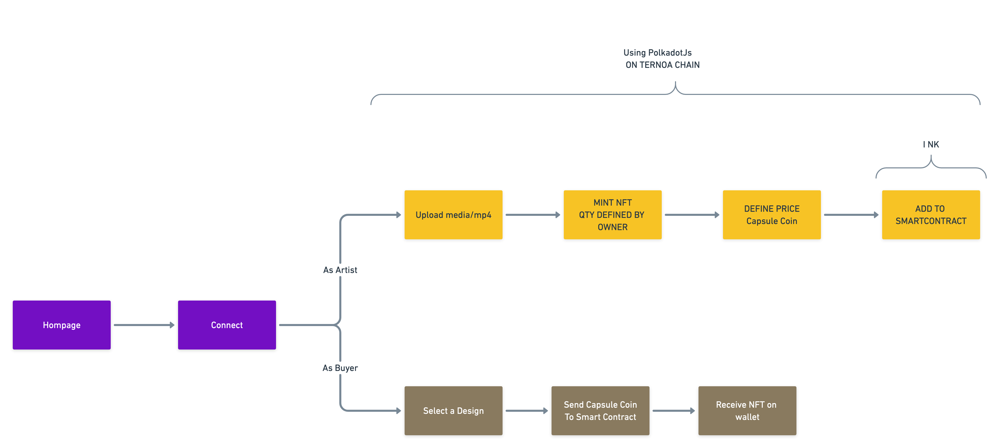

# Getting started

Front-end for NFT-marketplace web application.

Related APIS/blockchain APIs are: TBD

## High Level Design



## Technology stack

This application is based on [Create-react-app](https://reactjs.org/docs/create-a-new-react-app.html) with typescript.

A `backend` based on ([express](https://www.npmjs.com/package/express)) is included into the application (`server/server.ts`) and act as 'super-proxy' for calling external API/blockchain.

The external APIS are mocked with `mockserver`.

## Install

Install all requiered packages with

```
npm install
```

## How to run locally

```
npm run dev
```

(WIP) This command will start multiples npm tasks :

- `start-mockup`, for starting the mockup for the external APIs (_port 8282_)
- `start-backend`, for starting the backend (_port 8181_)
- `start`, for starting the application through `dev react server` (_port 3000_)


# How to run the tests

All the Tests can be run in interactive mode with

```
npm test
```

# About authentication process

TBD

# How to do a PR

Please don't push directly to an environment branch. If you don't know how to make a PR, please ask to someone.

# Maintenance mode

TBD

## Branch strategy

We are using `Trunk base on test Branch` strategy

## CI/CD strategy & pipeline

Jenkins will be here soon .... stay tuned !
